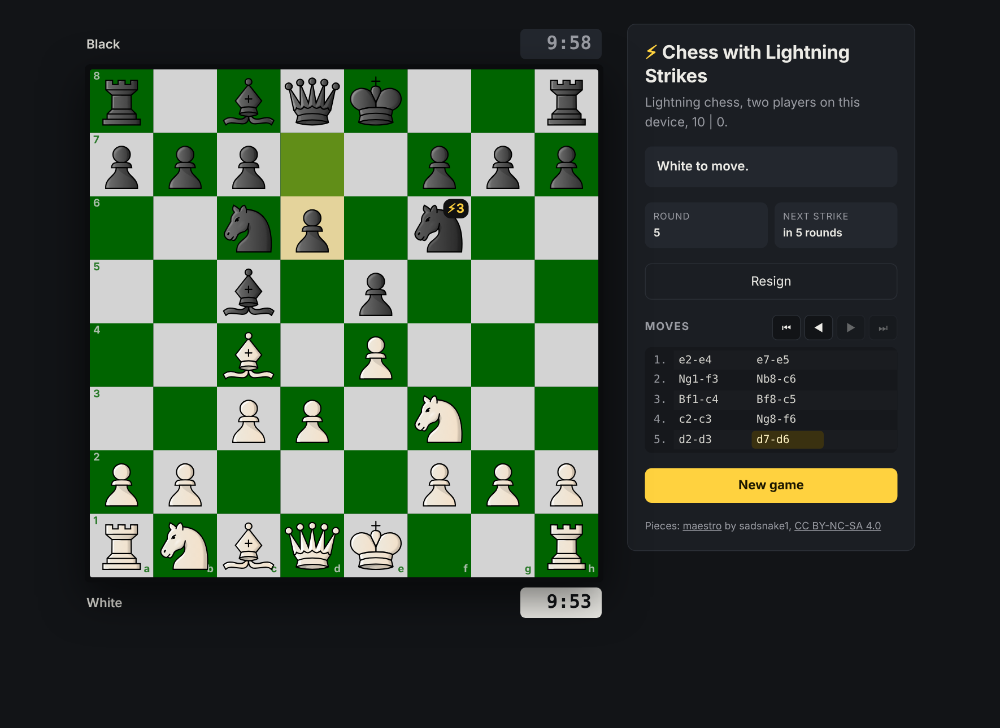
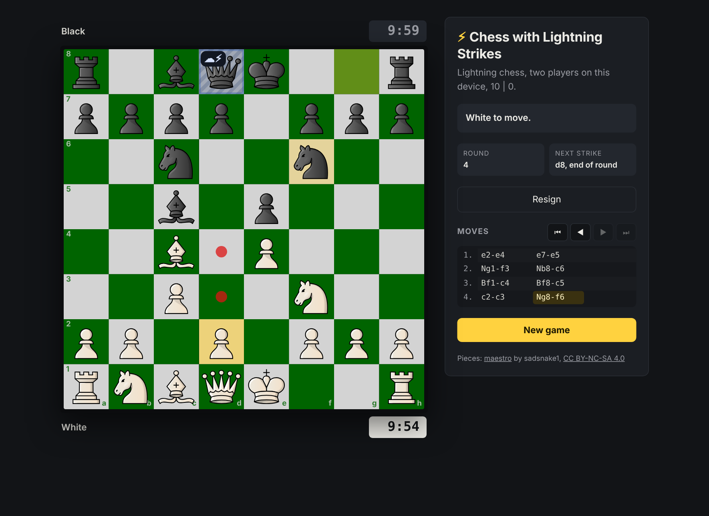
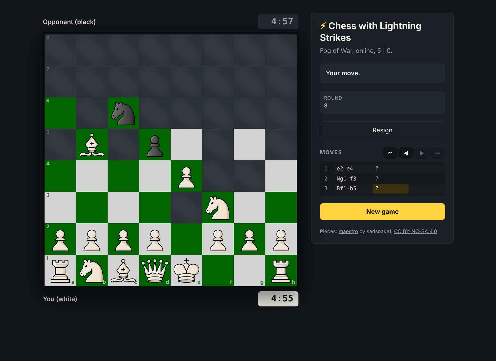
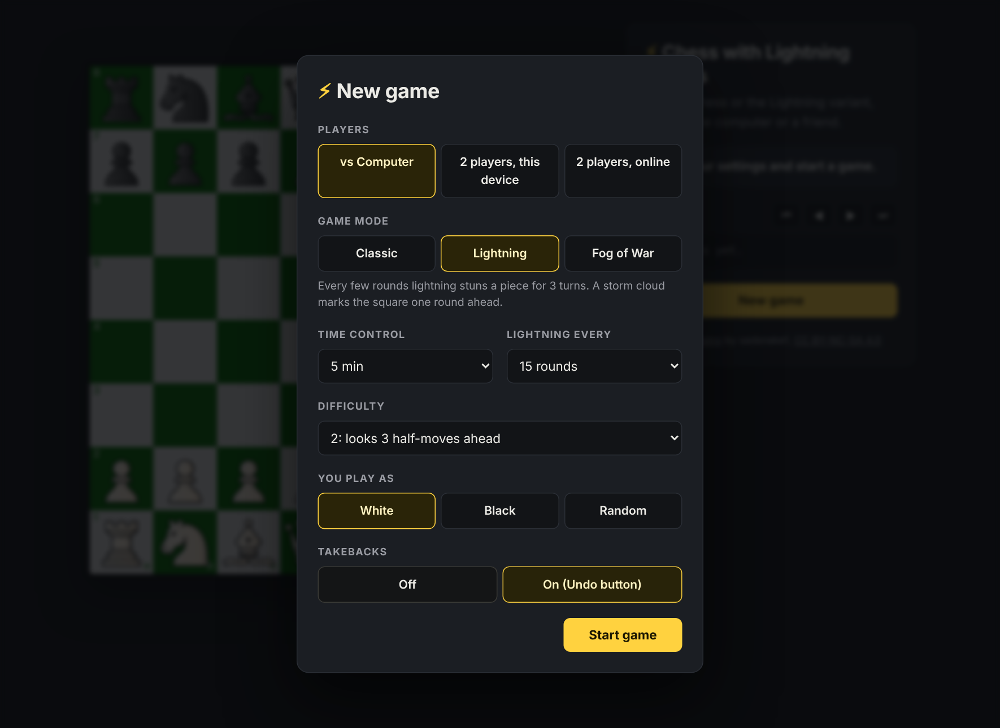
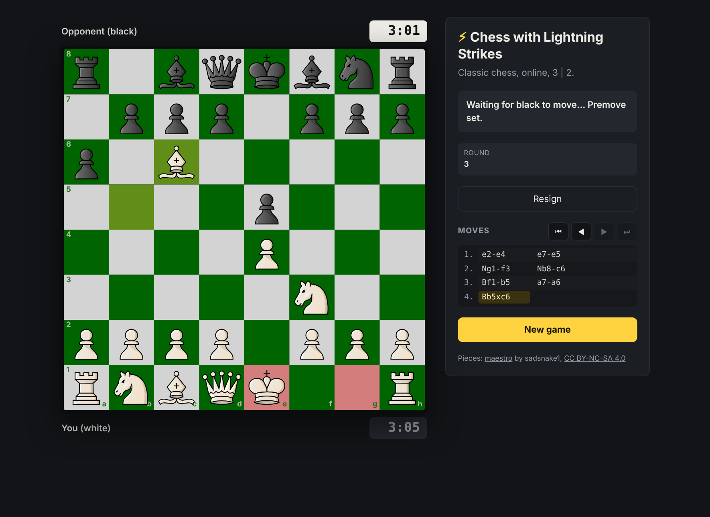
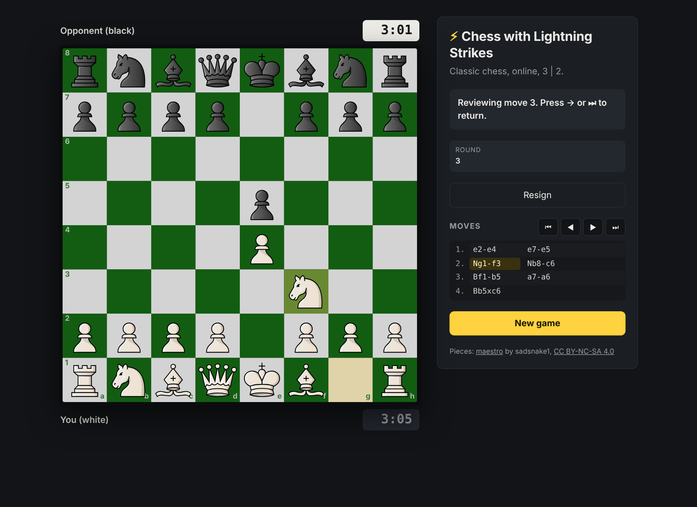
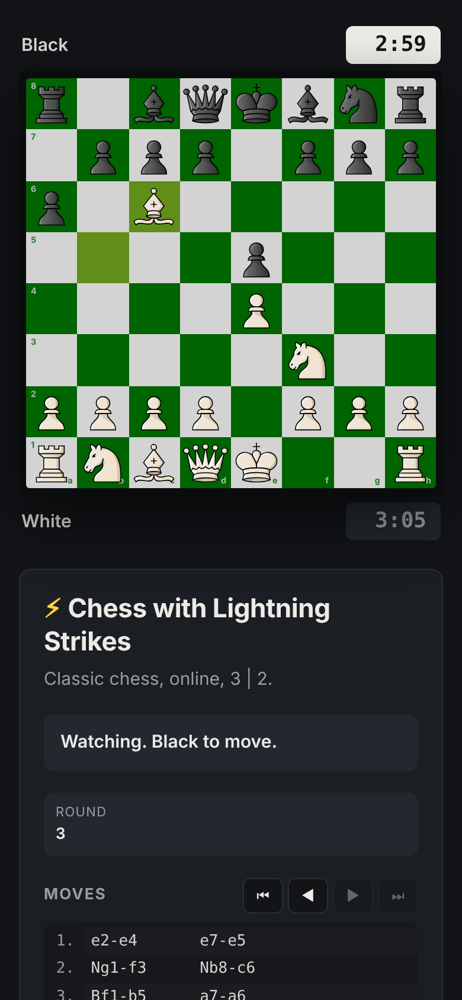

# Chess with Lightning Strikes

**HOSTED LIVE: https://thunderchess.fly.dev/**

A chess game a new mode: every few rounds, lightning strikes the board and stuns a piece for 3 turns. A storm cloud warns you one round ahead. There is also a Fog of War mode where you only see what your pieces can reach. Feel free to play in the browser against the computer, with a friend on the same device, or online against someone on another computer. A desktop version built with pygame shares the same engine.



## Features

- **Three game modes:** Classic (standard chess), Lightning, and Fog of War.
- **Three ways to play:** vs the computer, two players on one device, or two players online with an invite link.
- **Computer opponent:** 6 difficulty levels plus a dynamic level that adapts to how you're doing. You can play either color.
- **Clocks:** no clock, or bullet, blitz and rapid presets similar to chess.com modes
- **Full chess rules:** castling, en passant, promotion to any piece, and every draw rule (stalemate, threefold repetition, 50-move rule, insufficient material, timeout vs insufficient material). The game ends automatically, like on chess.com. Fog of War follows chess.com's Fog of War rules.
- **Premoves:** queue your next move while your opponent thinks. It plays the moment your turn starts, or is dropped if it isn't legal by then.
- **Move history:** click any move, or use the arrow keys, to see that position.
- **Undo:** against the computer only, and only if undos are switched on before the game.
- **Resign:** with a confirmation click.

## Lightning rules

- Lightning strikes after every N full rounds (one white move plus one black move). You pick N, from 5 to 50, before the game.
- **Forecast:** one round before each strike, a storm cloud appears over a random occupied square. Each player then gets one move before it lands.
- The strike hits whatever stands on that square when it lands: the original piece, a piece that moved there, or nothing if the square is empty. Step away to dodge it, or lure an enemy piece onto it.
- A stunned piece can't move or capture, and it doesn't give check or guard squares. It shows a stunned icon with the turns left.
- A stun lasts 3 full rounds. Capturing a stunned piece removes the stun with it.
- A stunned rook or king can't castle.
- If a strike leaves a player with no legal moves and their king isn't in check, the game is a stalemate.
- For repetition, stuns and a pending storm cloud are part of the position, because they change what can happen next.
- The computer plays around the cloud: it moves its own pieces off and likes seeing yours stay on.



## Fog of War rules

- You see your own pieces and only the squares they can move to right now. Everything else is fog.
- There is no check or checkmate. You win by capturing the king, and you may move into danger without warning.
- There is no stalemate trap: if every move loses the king, you still have to make one.
- The 50-move rule and threefold repetition still apply. Running out of time always loses, because any piece might still capture a king that wanders into it.
- **Online:** each player sees only their own view. Spectators see nothing until the game ends, so nobody can watch and pass positions to a player.
- **Same device:** a "pass the device" screen covers the board between turns, and the board turns to face the player to move.
- **vs the computer:** the computer sees the whole board. Playing well with hidden information is a research problem of its own.
- When the game ends, everything is revealed, including the full move list and the review positions.



## How to run

```bash
python -m venv .venv
source .venv/bin/activate        # Windows: .venv\Scripts\activate
pip install -r requirements.txt
cd web
npm install
npm run build
cd ..
python -m flask --app server.app run
```
LAST STEP!
Open http://127.0.0.1:5000 in any browser to play.

## Project layout

```
engine/          rules, AI and game flow, no UI code
  board.py       board, move generation, make/unmake, incremental evaluation
  search.py      the AI: alpha-beta search
  game.py        modes, variants, clocks, draw rules, resign, undo, lightning, fog views, save/load
  tables.py      heauristics for each piece's placement evaluation done by ai
server/          Flask API and SQLite game storage
  app.py
  store.py
web/             TypeScript frontend with index.html
  dist/
    index.html
  src/
    api.ts
    main.ts      
    stlyes.css   Just the css styling for the website
tests/           Each file tests one aspect of the game
  conftest.py
  test_api.py
  test_engine.py
  test_game.py
  test_rules.py
  test_search.py
  test_variants.py
Dockerfile       For docker
fly.toml         Fly.io configuration to host online
```

## How it works

### The AI

The AI uses alpha-beta search with a time limit: it searches 1 move ahead, then 2, then 3, and stops when its time budget runs out, always keeping the best move from the last finished depth. That gives each difficulty level a guaranteed maximum thinking time.

### Real-time updates

Online games use long-polling. Each player's browser keeps one request open (`GET /api/games/<id>?wait=1&since=<version>`). The server holds it and checks the game's version number every 0.15 s, answering as soon as anything changes: a move, a join, a resignation, or a flag falling. After 25 quiet seconds it returns an empty 204 and the browser asks again.

### Fog of War: the server only sends what you can see

Hiding the opponent in the browser with CSS would be trivial to game: open the developer tools and read the data. So the server builds a separate view for each player and replaces every square they can't see with `?` before anything leaves it. The same filter covers every field that could leak information:

### Concurrency

Every saved game has a version number. A save only succeeds if the version hasn't changed since the game was loaded, so two requests racing on the same game can't both apply a move.

### Online seats

Whoever creates an online game gets a secret seat token. The first person to open the invite link gets the other one, and anyone after that can only watch. The server stores tokens as SHA-256 hashes, compares them in constant time, and checks them on every move, so knowing the game's link isn't enough to move pieces. The browser keeps its token in local storage, so a reload keeps your seat.

### Move history without the bandwidth

Reviewing past moves needs every earlier position. Instead of sending all of them on every update, the client tells the server how many it already has (`?have=n`) and receives only the new ones. A late-game update stays around 1 to 2 KB instead of 30 KB.

## Security

- **Server authority:** all state, rules, randomness and timing live on the server (see [The server is the referee](#the-server-is-the-referee)).
- **Information hiding:** in Fog of War each player receives only their own view, and spectators receive nothing until the end (see [Fog of War: the server only sends what you can see](#fog-of-war-the-server-only-sends-what-you-can-see)).
- **Strict input checks:** exact JSON keys, exact types (`true` is not a difficulty level), square names matching `[a-h][1-8]`, ids and tokens matching their generated format. Bodies over 1 KB are rejected.
- **Unguessable ids:** game ids are 128-bit random values. For vs-computer and same-device games, the id is what lets a reload resume the game. Online games also require a seat token.
- **Limits:** AI thinking time is capped, rate limits apply per IP, and the number of stored games is bounded.
- **Browser hardening:** a strict Content-Security-Policy (`script-src 'self'`, no inline scripts, no `eval`), plus HSTS, `nosniff`, `no-referrer` and `frame-ancestors 'none'`. API responses are `no-store`. The Docker image runs the server as an unprivileged user.
- **Error handling:** stack traces go to the server log only. Clients see a generic error.

## Known limits

- No draw offers.
- Online games without a clock that get abandoned simply expire after `GAME_TTL_HOURS`.
- The AI runs inside the move request, so each worker process handles one AI move at a time.

## Screenshots

| Start screen | Online game with a premove queued |
|---|---|
|  |  |

| Reviewing an earlier move | Phone |
|---|---|
|  |  |
